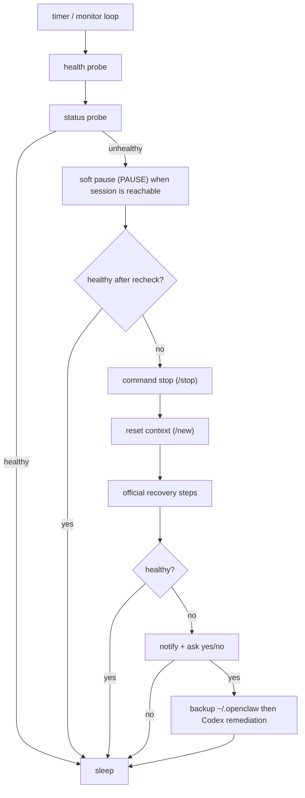

# 🦀 fix-my-claw

[中文](README_ZH.md)

[](LICENSE)
[](#requirements)

A plug-and-play watchdog for OpenClaw — keep it healthy automatically.


## ✨ Highlights

- 🩹 **Auto-heal**: detects unhealthy states and runs recovery steps automatically.
- 🧱 **Layered recovery**: try a soft `PAUSE` first when the session is still reachable, then escalate to `/stop`, `/new`, and official structural repair only if needed.
- 🔁 **Anomaly guard**: detects "healthy probes but agent ping-pong/repeat loops" from recent logs.
- 🔔 **Human approval gate**: optional Discord notification + `yes/no` reply before enabling Codex repair.
- 🧾 **Operator-friendly**: writes a timestamped incident folder under `~/.fix-my-claw/attempts/` for debugging.
- 🧯 **Safe defaults**: repair cooldown + daily attempt limits + single-instance lock to avoid flapping.
- 🧷 **Service-ready**: ships with Linux `systemd` and macOS `launchd` templates.

- One command to start: `fix-my-claw up`
- Probes `openclaw gateway health --json` + `openclaw gateway status --json`
- Recovers using your official steps (defaults included)
- Optional: Codex-assisted remediation for stubborn cases (off by default, restricted by default)

## 🚀 Quick start

Run the commands below from the repository root.

```bash
python -m venv .venv
source .venv/bin/activate
pip install -e .

fix-my-claw up
```

Default paths:

- Config: `~/.fix-my-claw/config.toml` (auto-created by `fix-my-claw up`)
- Logs: `~/.fix-my-claw/fix-my-claw.log`
- Attempts: `~/.fix-my-claw/attempts/<timestamp>/`

## ✅ Requirements

- Python 3.9+
- OpenClaw installed and available as `openclaw` in `PATH`

## 📦 Install and update model

The only supported CLI entrypoint is `fix-my-claw` (package entrypoint `fix_my_claw.cli:main`).
Do not depend on `fix_my_claw.core`.

Recommended workflows:

- Working from this repo: use `pip install -e .`
- Frozen install for deployment: use `pip install .`

Update rules:

- If you installed with `pip install -e .`, normal source edits are picked up immediately.
- If you installed with `pip install .`, rerun `pip install .` after pulling new commits.
- If packaging metadata or console-script wiring changes, rerunning the install command is always safe.

## 🧰 Commands

```bash
fix-my-claw start   # enable monitoring; active monitor loops resume
fix-my-claw stop    # disable monitoring; monitor loops idle
fix-my-claw status  # show whether monitoring is enabled plus persisted state
fix-my-claw up      # init (if needed) + monitor
fix-my-claw check   # one-time probe
fix-my-claw repair  # one-time recovery attempt
fix-my-claw monitor # long-running loop (requires config)
fix-my-claw init    # write default config
```

## 🧭 How it works (high-level)



## ⚙️ Configuration

All settings live in a single TOML file.

- Default: `~/.fix-my-claw/config.toml`
- Example: `examples/fix-my-claw.toml`
- New: `[anomaly_guard]` can mark multi-agent cycle/repetition patterns as unhealthy even when gateway probes still pass.
- New: `StagnationDetector` can also flag low-novelty recent tails where many agent turns keep circling the same semantic cluster without forming a clean cycle.
- `auto_dispatch_check` now analyzes real handoffs: who delegated, who was the target, and whether an unexpected agent keeps speaking afterwards.
- New: `[notify]` supports Discord notifications and yes/no approval prompts.
- Note: status notifications are always sent; `yes/no` approval is only used when `ai.enabled = true`.
- Note: when `notify.target` is a channel (`channel:...`), yes/no replies must mention the notify account (for example, `@fix-my-claw yes`).
- Note: only strict replies `yes/no` or `是/否` are accepted; non-matching replies trigger a re-ask, and after 3 invalid replies AI repair is skipped for this incident.
- Extended: `[repair]` adds session-level control knobs for soft `PAUSE`, `/stop`, `/new`, and active-session filtering.
- Compatibility: legacy key `[loop_guard]` is still accepted.
- Preferred knob names are `min_cycle_repeated_turns` and `max_cycle_period`; legacy `min_ping_pong_turns` is still accepted as an alias.
- Additional stagnation knobs are `stagnation_enabled`, `stagnation_min_events`, `stagnation_min_roles`, and `stagnation_max_novel_cluster_ratio`.

Tip: if `openclaw` isn’t on `PATH` under systemd/launchd, set `[openclaw].command` to an absolute path.

## 🖥️ Run it on a server (systemd)

Two options in `deploy/systemd/`:

- **Option A (recommended)**: `fix-my-claw.service` runs a long-lived monitor loop.
- **Option B**: `fix-my-claw-oneshot.service` + `fix-my-claw.timer` runs `fix-my-claw repair` periodically (cron-style).

Example (Option A):

```bash
python -m venv .venv
source .venv/bin/activate
pip install .

sudo mkdir -p /etc/fix-my-claw
sudo cp examples/fix-my-claw.toml /etc/fix-my-claw/config.toml

FIX_MY_CLAW_BIN="$(command -v fix-my-claw)"
sudo ./deploy/systemd/install.sh --fix-my-claw-bin "$FIX_MY_CLAW_BIN"
sudo systemctl daemon-reload
sudo systemctl enable --now fix-my-claw.service
```

Notes:

- The rendered unit stores the absolute path from `--fix-my-claw-bin`.
- If your virtualenv path changes, rerun `deploy/systemd/install.sh`.

## 🍎 Run it on macOS (launchd)

Recommended setup from the repository root:

```bash
python -m venv .venv
source .venv/bin/activate
pip install -e .

./deploy/launchd/install.sh --fix-my-claw-bin "$(command -v fix-my-claw)"
```

If you already installed `fix-my-claw` elsewhere, pass that absolute binary path explicitly:

```bash
./deploy/launchd/install.sh --fix-my-claw-bin "$(command -v fix-my-claw)"
```

Behavior:

- Install enables monitoring and bootstraps the launchd job immediately.
- `fix-my-claw start` turns monitoring on.
- `fix-my-claw stop` turns monitoring off. The launchd job stays loaded and idles until you unload it manually or uninstall.

If the virtualenv path changes later, rerun `pip install -e .` if needed and then rerun `deploy/launchd/install.sh`.

## ⬆️ Updating after `git pull`

Editable install (`pip install -e .`):

```bash
source .venv/bin/activate
git pull
```

Usually that is enough. Rerun `pip install -e .` only if packaging metadata, console scripts, or the virtualenv path changed.

Frozen install (`pip install .`):

```bash
source .venv/bin/activate
git pull
pip install .
```

For both modes, if the `fix-my-claw` binary path changed, rerun the matching `deploy/systemd/install.sh` or `deploy/launchd/install.sh`.

One-click uninstall:

```bash
./deploy/launchd/uninstall.sh
```

Skip legacy rc-block cleanup:

```bash
./deploy/launchd/uninstall.sh --keep-hook
```

Useful commands:

```bash
# Status
launchctl print "gui/$(id -u)/com.fix-my-claw.monitor"

# Fully unload the launchd job
launchctl bootout "gui/$(id -u)" ~/Library/LaunchAgents/com.fix-my-claw.monitor.plist
```

## 🧩 Codex-assisted remediation (optional)

When enabled, `fix-my-claw` runs Codex CLI non-interactively.

- Default config uses `codex exec` with `approval_policy="never"`.
- Stage 1 is restricted to OpenClaw config/state + workspace + fix-my-claw state directory.
- Stage 2 is disabled by default (`ai.allow_code_changes=false`).

## 🩺 Troubleshooting

- `command not found: openclaw`
  - Ensure OpenClaw is installed and `openclaw` is on `PATH` (especially under systemd/launchd).
  - Or set `[openclaw].command` to an absolute path.
- `another fix-my-claw instance is running`
  - A lock file in `[monitor].state_dir` prevents concurrent repairs.
  - If you believe it’s stale, confirm no instance is running, then remove the lock file.

## 🤝 Contributing

See `CONTRIBUTING.md`, `CODE_OF_CONDUCT.md`, and `SECURITY.md`.

## 📄 License

MIT, see `LICENSE`.
