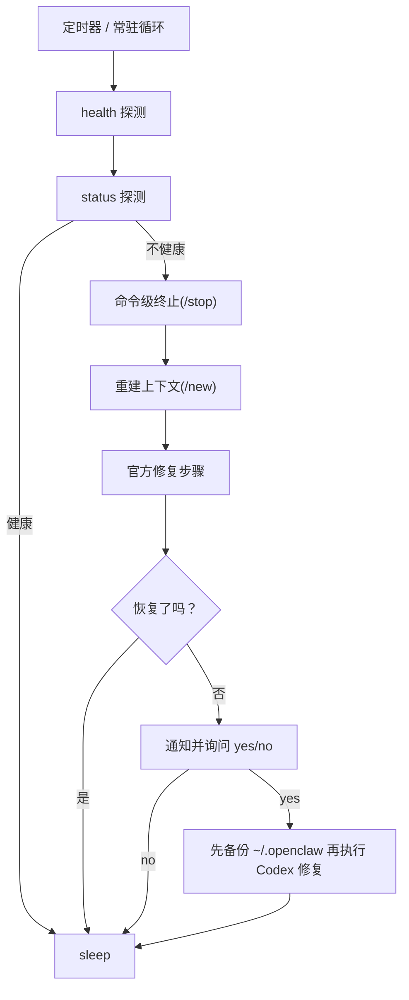

# 🦀 fix-my-claw

[English](README.md)

[](LICENSE)
[](#前置条件)

一个开箱即用的 OpenClaw 守护与自动恢复工具，让服务自己保持健康。


Agent Reach 状态
✅ 装好即用：
✅ GitHub 仓库和代码 — 完整可用（读取、搜索、Fork、Issue、PR 等）
❌ YouTube 视频和字幕 — yt-dlp 未安装。安装：pip install yt-dlp
✅ RSS/Atom 订阅源 — 可读取 RSS/Atom 源
✅ 全网语义搜索 — 全网语义搜索可用（免费，无需 API Key）
✅ 任意网页 — 通过 Jina Reader 读取任意网页（curl https://r.jina.ai/URL）

🔍 搜索（mcporter 即可解锁）：
✅ Twitter/X 推文 — 完整可用（读取、搜索推文）
⬜ Reddit 帖子和评论 — 无代理。服务器 IP 可能被 Reddit 封锁。配置代理：
agent-reach configure proxy http://user:pass@ip:port
⬜ B站视频和字幕 — yt-dlp 未安装。安装：pip install yt-dlp

🔧 配置后可用：
⚠️ 小红书笔记 — MCP 连接异常，检查 xiaohongshu-mcp 服务是否在运行
⚠️ 抖音短视频 — MCP 已连接但调用异常，检查 douyin-mcp-server 服务是否在运行
⬜ LinkedIn 职业社交 — mcporter 已装但 LinkedIn MCP 未配置。运行：
pip install linkedin-scraper-mcp
mcporter config add linkedin http://localhost:3000/mcp
⬜ Boss直聘职位搜索 — mcporter 已装但 Boss直聘 MCP 未配置。
详见 https://github.com/mucsbr/mcp-bosszp
✅ 微信公众号文章 — 完整可用（搜索 + 阅读公众号文章）

状态：6/13 个渠道可用
运行 agent-reach setup 解锁更多渠道


## ✨ 效果与亮点

- 🩹 **自动自愈**：检测到异常后自动执行修复步骤。
- 🧱 **分层修复**：先命令级终止会话，再发 `/new`，再执行官方结构修复步骤。
- 🔁 **异常守卫**：可从近期日志识别“探针健康但 Agent 在重复/ping-pong”的异常。
- 🔔 **人工确认开关**：支持通过 Discord 通知并回复 `yes/no` 决定是否启用 Codex 修复。
- 🧾 **好排障**：每次异常会在 `~/.fix-my-claw/attempts/` 下保存带时间戳的现场产物。
- 🧯 **默认更稳**：修复冷却、每日次数限制、单实例锁，避免反复抖动。
- 🧷 **服务化部署就能用**：内置 Linux `systemd` 与 macOS `launchd` 模板。

- 一键启动：`fix-my-claw up`
- 定时探测：`openclaw gateway health --json` + `openclaw gateway status --json`
- 优先使用官方修复步骤（默认已内置）
- 可选：Codex 辅助修复（默认关闭，且默认只允许改配置/workspace）

## 🚀 快速开始

```bash
python -m venv .venv
source .venv/bin/activate
pip install .

fix-my-claw up
```

默认路径：

- 配置：`~/.fix-my-claw/config.toml`（`fix-my-claw up` 会自动生成）
- 日志：`~/.fix-my-claw/fix-my-claw.log`
- 产物：`~/.fix-my-claw/attempts/<timestamp>/`

## ✅ 前置条件

- Python 3.9+
- 已安装 OpenClaw，并且 `openclaw` 可在 `PATH` 中直接调用

## 🧰 常用命令

```bash
fix-my-claw up      # 自动生成默认配置（如不存在）+ 启动常驻监控
fix-my-claw check   # 单次探测
fix-my-claw repair  # 单次修复尝试
fix-my-claw monitor # 常驻循环（要求配置已存在）
fix-my-claw init    # 生成默认配置
```

## 🧭 工作原理（概览）



## ⚙️ 配置

所有设置都在一个 TOML 文件里：

- 默认：`~/.fix-my-claw/config.toml`
- 示例：`examples/fix-my-claw.toml`
- 新增：`[anomaly_guard]` 可把 ping-pong/重复输出模式判定为不健康（即便 gateway 探针仍成功）。
- `auto_dispatch_check` 现在按真实 handoff 分析：识别谁发起交接、交接给谁，再判断后续是否由非预期角色持续输出。
- 新增：`[notify]` 可配置 Discord 通知与 yes/no 询问。
- 说明：流程状态通知始终会发送；`yes/no` 询问仅在 `ai.enabled = true` 时生效。
- 说明：当 `notify.target` 指向频道（`channel:...`）时，yes/no 需要在消息里 `@` 当前通知账号（如 `@fix-my-claw yes`）。
- 说明：只接受严格回复 `是/否/yes/no`；不匹配会重问，累计 3 次不匹配则本轮默认不启用 Codex。
- 扩展：`[repair]` 新增会话控制参数（`/stop`、`/new`、活跃会话筛选）。
- 兼容：仍支持旧键名 `[loop_guard]`。

提示：如果 systemd/launchd 环境下找不到 `openclaw`，请把 `[openclaw].command` 配成绝对路径。

## 🖥️ 服务器部署（systemd）

`deploy/systemd/` 提供两种方式：

- **方式 A（推荐）**：`fix-my-claw.service` 常驻监控
- **方式 B**：`fix-my-claw-oneshot.service` + `fix-my-claw.timer` 定时执行 `fix-my-claw repair`

示例（方式 A）：

```bash
sudo mkdir -p /etc/fix-my-claw
sudo cp examples/fix-my-claw.toml /etc/fix-my-claw/config.toml

FIX_MY_CLAW_BIN="$(command -v fix-my-claw)"
sudo ./deploy/systemd/install.sh --fix-my-claw-bin "$FIX_MY_CLAW_BIN"
sudo systemctl daemon-reload
sudo systemctl enable --now fix-my-claw.service
```

## 🍎 macOS 部署（launchd）

一键安装（单一入口）：

```bash
./deploy/launchd/install.sh
source ~/.zshrc
```

如果当前 shell 里 `fix-my-claw` 解析不到，也可以显式传入：

```bash
./deploy/launchd/install.sh --fix-my-claw-bin "$(command -v fix-my-claw)"
```

行为：

- `openclaw gateway start` / `restart`：自动拉起监管后台
- `openclaw gateway stop`：自动停止监管后台

一键卸载：

```bash
./deploy/launchd/uninstall.sh
```

如需保留 shell hook：

```bash
./deploy/launchd/uninstall.sh --keep-hook
```

常用命令：

```bash
# 查看状态
launchctl print "gui/$(id -u)/com.fix-my-claw.monitor"

# 停止/卸载
launchctl bootout "gui/$(id -u)" ~/Library/LaunchAgents/com.fix-my-claw.monitor.plist
```

## 🧩 Codex 辅助修复（可选）

开启后会使用 Codex CLI 全程无确认执行。

- 默认配置使用 `codex exec` + `approval_policy="never"`
- 第一阶段默认仅允许写：OpenClaw 配置/状态目录、workspace、以及 fix-my-claw 自己的 state 目录
- 第二阶段默认关闭（`ai.allow_code_changes=false`）

## 🩺 常见问题

- 提示 `command not found: openclaw`
  - 确保已安装 OpenClaw，且 `openclaw` 在 `PATH` 中（systemd/launchd 环境下尤其常见）。
  - 或将 `[openclaw].command` 配成绝对路径。
- 提示 `another fix-my-claw instance is running`
  - 通过 `[monitor].state_dir` 下的 lock 文件避免并发修复互相影响。
  - 如怀疑 lock 残留，请先确认没有实例运行，再删除 lock 文件。

## 🤝 参与贡献

见 `CONTRIBUTING.md`、`CODE_OF_CONDUCT.md` 与 `SECURITY.md`。

## 📄 开源协议

MIT License，见 `LICENSE`。
