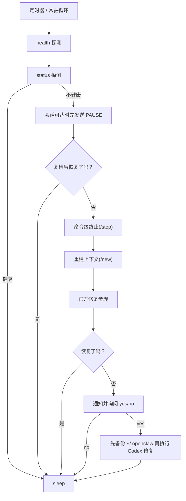

# 🦀 fix-my-claw

[English](README.md)

[](LICENSE)
[](#前置条件)

一个开箱即用的 OpenClaw 守护与自动恢复工具，让服务自己保持健康。


## ✨ 效果与亮点

- 🩹 **自动自愈**：检测到异常后自动执行修复步骤。
- 🧱 **分层修复**：会话仍可达时先尝试软暂停 `PAUSE` 保留现场；只有仍异常时才升级到 `/stop`、`/new` 和官方结构修复。
- 🔁 **异常守卫**：可从近期日志识别“探针健康但 Agent 在重复/ping-pong”的异常。
- 🔔 **人工确认开关**：支持通过 Discord 通知并回复 `yes/no` 决定是否启用 Codex 修复。
- 🧾 **好排障**：每次异常会在 `~/.fix-my-claw/attempts/` 下保存带时间戳的现场产物。
- 🧯 **默认更稳**：修复冷却、每日次数限制、单实例锁，避免反复抖动。
- 🧷 **服务化部署就能用**：内置 Linux `systemd` 与 macOS `launchd` 模板。

- 一键启动：`fix-my-claw up`
- 定时探测：`openclaw gateway health --json` + `openclaw gateway status --json`
- 优先使用官方修复步骤（默认已内置）
- 可选：Codex 辅助修复（默认关闭，且默认只允许改配置/workspace）

## 🚀 快速开始

以下命令默认都在仓库根目录执行。

```bash
python -m venv .venv
source .venv/bin/activate
pip install -e .

fix-my-claw up
```

默认路径：

- 配置：`~/.fix-my-claw/config.toml`（`fix-my-claw up` 会自动生成）
- 日志：`~/.fix-my-claw/fix-my-claw.log`
- 产物：`~/.fix-my-claw/attempts/<timestamp>/`

## ✅ 前置条件

- Python 3.9+
- 已安装 OpenClaw，并且 `openclaw` 可在 `PATH` 中直接调用

## 📦 安装方式与升级规则

唯一受支持的 CLI 入口是 `fix-my-claw`，它对应的包入口为 `fix_my_claw.cli:main`。
不要依赖 `fix_my_claw.core`。

推荐两种安装方式：

- 跟着当前仓库开发/调试：`pip install -e .`
- 固化部署：`pip install .`

更新规则：

- 如果你用的是 `pip install -e .`，普通源码改动会直接生效。
- 如果你用的是 `pip install .`，每次拉新代码后都要重新执行一次 `pip install .`。
- 如果改到了打包元数据或 console script，重新执行安装命令总是安全的。

## 🧰 常用命令

```bash
fix-my-claw start   # 开启监控；已运行的 monitor 会恢复工作
fix-my-claw stop    # 关闭监控；monitor 会进入 idle
fix-my-claw status  # 查看监控是否开启以及持久化状态
fix-my-claw up      # 自动生成默认配置（如不存在）+ 启动常驻监控
fix-my-claw check   # 单次探测
fix-my-claw repair  # 单次修复尝试
fix-my-claw monitor # 常驻循环（要求配置已存在）
fix-my-claw init    # 生成默认配置
```

## 🧭 工作原理（概览）



## ⚙️ 配置

所有设置都在一个 TOML 文件里：

- 默认：`~/.fix-my-claw/config.toml`
- 示例：`examples/fix-my-claw.toml`
- 新增：`[anomaly_guard]` 可把多角色 cycle/重复输出模式判定为不健康（即便 gateway 探针仍成功）。
- 新增：`StagnationDetector` 也会捕捉“最近很多 agent turn 围着同一语义反复打转，但没有形成干净周期”的低新颖度尾部。
- `auto_dispatch_check` 现在按真实 handoff 分析：识别谁发起交接、交接给谁，再判断后续是否由非预期角色持续输出。
- 新增：`[notify]` 可配置 Discord 通知与 yes/no 询问。
- 说明：流程状态通知始终会发送；`yes/no` 询问仅在 `ai.enabled = true` 时生效。
- 说明：当 `notify.target` 指向频道（`channel:...`）时，yes/no 需要在消息里 `@` 当前通知账号（如 `@fix-my-claw yes`）。
- 说明：只接受严格回复 `是/否/yes/no`；不匹配会重问，累计 3 次不匹配则本轮默认不启用 Codex。
- 扩展：`[repair]` 新增会话控制参数（软暂停 `PAUSE`、`/stop`、`/new`、活跃会话筛选）。
- 兼容：仍支持旧键名 `[loop_guard]`。
- 推荐优先使用 `min_cycle_repeated_turns` 和 `max_cycle_period`；旧键 `min_ping_pong_turns` 仍作为兼容别名接受。
- 低新颖度停滞检测可通过 `stagnation_enabled`、`stagnation_min_events`、`stagnation_min_roles`、`stagnation_max_novel_cluster_ratio` 调整。

提示：如果 systemd/launchd 环境下找不到 `openclaw`，请把 `[openclaw].command` 配成绝对路径。

## 🖥️ 服务器部署（systemd）

`deploy/systemd/` 提供两种方式：

- **方式 A（推荐）**：`fix-my-claw.service` 常驻监控
- **方式 B**：`fix-my-claw-oneshot.service` + `fix-my-claw.timer` 定时执行 `fix-my-claw repair`

示例（方式 A）：

```bash
python -m venv .venv
source .venv/bin/activate
pip install .

sudo mkdir -p /etc/fix-my-claw
sudo cp examples/fix-my-claw.toml /etc/fix-my-claw/config.toml

FIX_MY_CLAW_BIN="$(command -v fix-my-claw)"
sudo ./deploy/systemd/install.sh --fix-my-claw-bin "$FIX_MY_CLAW_BIN"
sudo systemctl daemon-reload
sudo systemctl enable --now fix-my-claw.service
```

说明：

- 渲染后的 unit 会写死 `--fix-my-claw-bin` 对应的绝对路径。
- 如果后面虚拟环境路径变了，需要重新执行一次 `deploy/systemd/install.sh`。

## 🍎 macOS 部署（launchd）

推荐在仓库(fix-my-claw)根目录这样安装：

```bash
python -m venv .venv
source .venv/bin/activate
pip install -e .

./deploy/launchd/install.sh --fix-my-claw-bin "$(command -v fix-my-claw)"
```

如果你已经把 `fix-my-claw` 装在别的位置，也可以显式传入那个绝对路径：

```bash
./deploy/launchd/install.sh --fix-my-claw-bin "$(command -v fix-my-claw)"
```

行为：

- 安装时会立即开启监控并启动 launchd job。
- `fix-my-claw start` 表示打开监控。
- `fix-my-claw stop` 表示关闭监控。launchd job 仍会保留并进入 idle；如需彻底卸载，请手动 `bootout` 或执行卸载脚本。

如果后面虚拟环境路径变了，先按需重新执行 `pip install -e .`，再重新执行 `deploy/launchd/install.sh`。

## ⬆️ `git pull` 之后怎么更新

如果你用的是 editable install（`pip install -e .`）：

```bash
source .venv/bin/activate
git pull
```

通常这样就够了。只有在打包元数据、console script 或虚拟环境路径发生变化时，才需要再执行一次 `pip install -e .`。

如果你用的是普通安装（`pip install .`）：

```bash
source .venv/bin/activate
git pull
pip install .
```

无论哪种方式，只要 `fix-my-claw` 的实际二进制路径变了，都需要重新执行对应的 `deploy/systemd/install.sh` 或 `deploy/launchd/install.sh`。

一键卸载：

```bash
./deploy/launchd/uninstall.sh
```

如需跳过旧版 rc 注入块清理：

```bash
./deploy/launchd/uninstall.sh --keep-hook
```

常用命令：

```bash
# 查看状态
launchctl print "gui/$(id -u)/com.fix-my-claw.monitor"

# 彻底卸载 launchd job
launchctl bootout "gui/$(id -u)" ~/Library/LaunchAgents/com.fix-my-claw.monitor.plist
```

## 🧩 Codex 辅助修复（可选）

开启后会使用 Codex CLI 全程无确认执行。

- 默认配置使用 `codex exec` + `approval_policy="never"`
- 第一阶段默认仅允许写：OpenClaw 配置/状态目录、workspace、以及 fix-my-claw 自己的 state 目录
- 第二阶段默认关闭（`ai.allow_code_changes=false`）

## 🩺 常见问题

- 提示 `command not found: openclaw`
  - 确保已安装 OpenClaw，且 `openclaw` 在 `PATH` 中（systemd/launchd 环境下尤其常见）。
  - 或将 `[openclaw].command` 配成绝对路径。
- 提示 `another fix-my-claw instance is running`
  - 通过 `[monitor].state_dir` 下的 lock 文件避免并发修复互相影响。
  - 如怀疑 lock 残留，请先确认没有实例运行，再删除 lock 文件。

## 🤝 参与贡献

见 `CONTRIBUTING.md`、`CODE_OF_CONDUCT.md` 与 `SECURITY.md`。

## 📄 开源协议

MIT License，见 `LICENSE`。
